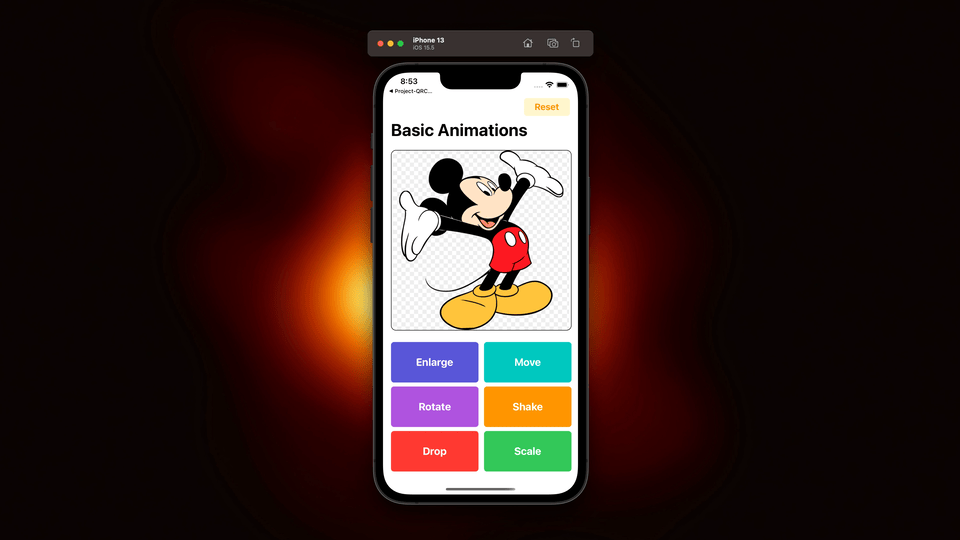

# Project-BasicAnimations

A simple UIKit demo project showing common animation techniques using UIView and Core Animation.

## Features

- Enlarge (Scale Up)
- Move (Translate)
- Rotate
- Shake (CABasicAnimation)
- Drop Animation
- Reset State

## Technologies Used

- Swift
- UIKit
- Core Animation (QuartzCore)
- CGAffineTransform

## Demo

## What I Learned

- Using UIView.animate
- Working with CGAffineTransform
- Layer-based animations
- Resetting animation state safely
- Writing reusable animation functions

## Requirements

- iOS 15+
- Xcode 14+

## Author

Amit Bhujbal
